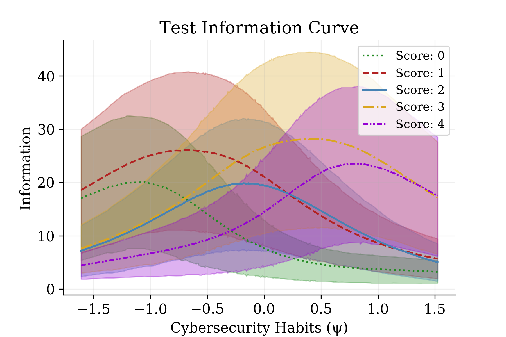

<h1> CHS Analysis GRM </h1>

	The present analysis implements a Bayesian graded response model (GRM) to estimate the item response to 44 items in a cybersecurity habits scale (CHS), where the latent trait (&psi;) is understood to be participants' cybersecurity habits (i.e. how secure is their behaviour when using electronic devices such as phones, computers, etc.). Although the scale incorporates 3 dimensions (blocking, hiding, inspecting) representing possible types of cybersecurity behaviours/habits, the present model does not make any assumption about differences across these dimensions.  

<h1> Model </h1>

 The model follows a conventional GRM approach, with a discrimination parameter ranging over items (&delta;i), a latent trait parameter ranging over subjects/participants (&psi;s), and a conventionality parameter ranging over items and ordered categories of scores (&kappa;i,c), which indicates how common/uncommon it is to engage in the behaviour described by the item (this is referred to as difficulty when a test involves correct/incorrect responses). In other words, an item answered with the highest score by most participants, irrespective of their cybersecurity habits level, would indicate behaviour that is too conventional and vice-versa. In the present case the discrimination parameter (&delta;) is only multiplied by the participants' trait parameter (&psi;); which provided better convergence and fit. Reasonable if we think of &delta; and &kappa; as the scale and location of &psi; respectively. The model is completed by an ordered logistic distribution over the estimated parameter (y&#770;). 

 &delta;i ~ Log-normal(0, 0.5), itemi=1...itemi=44 

 &psi;s ~ Normal(0, 0.5), subjects=1...subjects=134 

 &mu; ~ Normal(0, 0.05) 

 &sigma; ~ Half-normal(0.5) 

 &kappa;i,c ~ Normal(&mu;, &sigma;), itemi=1...itemi=44, cutpointc=1...cutpointi=C-1, C=5 
 

 &eta; = &delta;i&psi;s 

 logit-1(x) = 1/(1 + e-x) 

 y&#770; = 1 - logit-1(&eta; - &kappa;1), if c = 0 

 y&#770; = logit-1(&eta; - &kappa;c-1) - logit-1(&eta; - &kappa;c), if 0 < c < C 

 y&#770; = logit-1(&eta; - &kappa;c-1), if c = C, C = 5 

	

 Before running the model, we ensured that priors were weakly informative but sensible via a prior predictive check. With no specific expectations per item, we placed the greater probability on the median of the Likert scale (2 points). Image below gives an example of prior predictive check probability over item 33. 

	

<h1> Results </h1>

 We sampled the model using Markov chain Monte Carlo (MCMC) No U-turn sampling (NUTS) with 2000 tuning steps, 2000 samples, 4 chains and 0.99 acceptance target. The model sampled well, with 1.01 > R&#770; > 0.99;  BFMIs > 0.8, and bulk ESS > 1800 for all parameters. Posterior predictive checks show excellent predictive capacity, as indicated in the image below.  

	

 Expectations show very good precision (max ~15%), though slightly higher than previous structural equations models (https://github.com/SimonErnesto/bsem_precision_analysis). An example in the image below. 

	

 Informative items should present item characteristic curves (ICCs) where the probability of giving low scores to an item should be low if a participant has low cybersecurity habits (&psi;) and vice-versa. The ICC curve is simply the expected probability of the model ranging across the estimated cybersecurity habits parameter (&psi;). Image below shows an example of an informative item, where low cybersecurity habits are associated with a greater probability (68%) of giving a 0 score, while high cybersecurity habits are associated with a high probability (63%) of giving a 4 score. 

	

 Similarly, informative items should present item information curves (ITCs) where the probability of giving low scores to an item should be low if a participant has low cybersecurity habits (&psi;) and vice-versa. The ITC curve follows the function I(&psi;) = &delta;2(p(1-p)), where p = logit-1(&delta;i&psi;s - &kappa;i,c) , ranging across the estimated cybersecurity habits parameter (&psi;). Image below shows an example of an informative item, where information peaks per score concentrate at increasingly higher values of &psi;. This indicates that item's scores are informative respect to participants' cybersecurity levels. 

	

 Finally, the test characteristic curve (TCC: sum of expected probability across items) and the test information curve (TIC: &Sigma;Ss=1 = Is(&psi;) ) indicate that, overall, the CHS scale provides good information about cybersecurity habits. Images below show TCC and TIC. TCCs indicates a stronger preference for higher scores (3 and 4) when cybersecurity habits are high, but a high overlap of scores when cybersecurity habits are low. TICs suggest that scores are generally informative at sensible cybersecurity habits values (chv), with score 0 peaking (~20 info) between -1.5 and -1.0 chv, score 1 peaking (~25 info) between -1.0 and -0.5 chv, score 2 peaking (~20 info) between -0.5 and 0.0 chv, score 3 peaking (~28 info) around 0.5 chv, and score 4 peaking (~25 info) between 0.5 and 1.0 chv. Namely, low scores appropriately represent low habits and vice-versa. 
 

	
	

<h1> Conclusion </h1>  

 Present results indicate that the present cybersecurity habits scale (CHS) is generally effective for inferring and predicting cybersecurity habits. Even so, most items seem to be lowly informative, which may suggest that reducing the scale is a relevant further step. CHS can be tuned to become a useful instrument for measuring cybersecurity behaviours regarding cyber-hygiene habits. 
